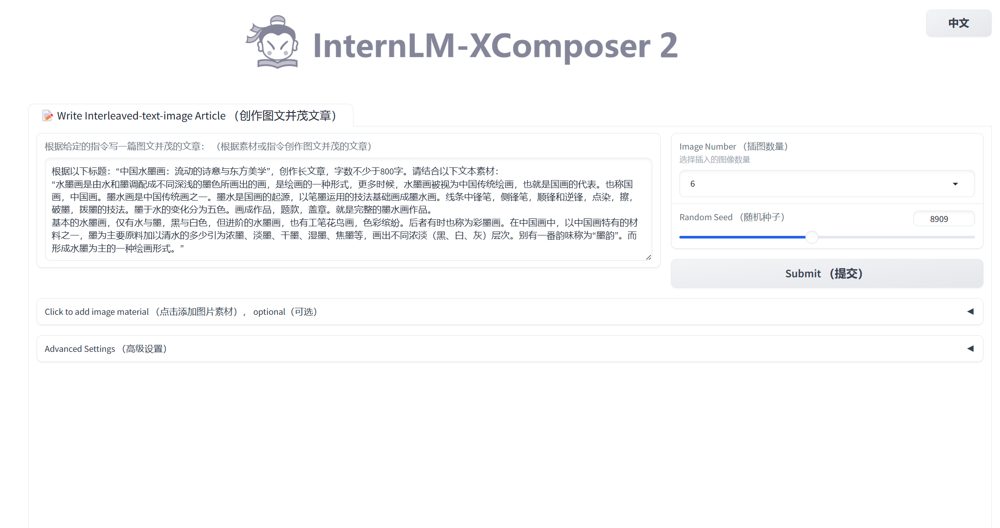
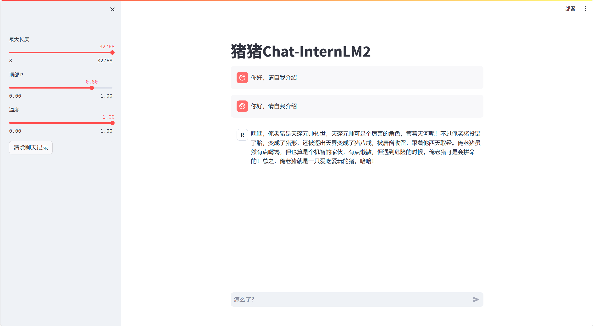

# 【书生·浦语大模型实战营】笔记 & 作业
## 目录
### [第一课](#第一课)
* [书生·浦语大模型全链路开源体系](#书生·浦语大模型全链路开源体系 )
* [internLM2技术报告](#internLM2技术报告)
### [第二课](#第二课)
### [第三课](#第三课)  

## 第一课
### 书生·浦语大模型全链路开源体系
#### 背景
`ChatGPT`和`GPT-4`等`大语言模型（LLM）`的发展引发了关于`通用人工智能（AGI）`的讨论，即从针对特定任务的专用模型，转变为一个模型应对多种任务与模态。
#### 数据
`2TB`多模态数据 
* 书生·万卷1.0
* 书生·万卷CC
   
[数据获取](https://opendatalab.org.cn/)

#### 预训练
`InternLM-Train`
* 高可扩展
* 开箱即用
* 极致性能优化
* 兼容主流

#### 微调
`XTuner`  ：适配多种生态，多种硬件
  
***支持全参数微调和LoRA低成本微调***
* **有监督微调**
  * 使用场景：让基座模型学习到一些新知识，如某个垂类领域知识
  * 训练数据：文章、书籍、代码等
* **增量续训**
  * 使用场景：让模型学会理解各种指令进行对话，或者注入少量领域知识训练数据
  * 训练数据：高质量的对话、问答数据

#### 部署
`LMDeploy`：提供大模型在GPU上部署的全流程解决方案

* 高效推理引擎
* 完备易用的工具链
* 支持交互式推理

#### 评估
[`OpenCompass`](https://opencompass.org.cn/)
* CompassRank（性能排行榜）
* CompassKit（全栈评估工具）
* CompassHub（高质量评估基准社区）

#### 应用
* 轻量级智能体框架 `Lagent`
* 多模态代理工具箱 `AgentLego`
  
支持多种智能体，支持代码解释器等多种工具

  

### internLM2技术报告
[`原文链接`](https://arxiv.org/pdf/2403.17297.pdf)  
#### 创新技术亮点
* *长上下文处理能力*
* *全面性能改进*
* *增强对话与创作体验*
* *扩展工具调用功能*
* *强大的推理与数据分析能力*
#### 基础设施与模型架构
`InternEro`训练框架：具有**长序列训练**、**容错**、和**交互式训练**的功能
  
`LLaMA`设计原则：集成并重新配置矩阵，提高分布式环境的灵活性与效率
  

#### 预训练 Pre-train
##### 文本数据  
存储格式：`jsonl`  

  

##### 代码数据      
存储格式：`markdown`    

##### 长文本数据    
数据过滤管道：长度选择、统计过滤器、语言模型perplexity  
#### Alignment
* ***有监督微调***
* ***COOL RLFH***
  * 整合多个偏好建立奖励机制
  * 将不同的prompt应用于不同类型的偏好
#### 评估与总结
`InternLM2`大语言模型在主观和客观的评估中都表现出出色的性能。  

## 第二课
`项目实战课`
* 部署`InternLM2-Chat-1.8B`模型进行智能对话
  
结果： 
  

* 部署实战营优秀作品`八戒-Chat-1.8B`模型

  
结果：

* 通过`InternLM2-Chat-7B`运行 ***Lagent*** 智能体 Demo

结果：  

* 实践部署`浦语·灵笔2`模型

  

