# 【书生·浦语大模型实战营】笔记 & 作业
## 目录
### [第一课](#第一课)
* [书生·浦语大模型全链路开源体系](#书生·浦语大模型全链路开源体系 )
* [internLM2技术报告](#internLM2技术报告)
### [第二课](#第二课)
### [第三课](#第三课)  

## 第一课
### 书生·浦语大模型全链路开源体系
#### 背景
`ChatGPT`和`GPT-4`等`大语言模型（LLM）`的发展引发了关于`通用人工智能（AGI）`的讨论，即从针对特定任务的专用模型，转变为一个模型应对多种任务与模态。
#### 数据
`2TB`多模态数据 
* 书生·万卷1.0
* 书生·万卷CC
   
[数据获取](https://opendatalab.org.cn/)

#### 预训练
`InternLM-Train`
* 高可扩展
* 开箱即用
* 极致性能优化
* 兼容主流

#### 微调
`XTuner`  ：适配多种生态，多种硬件
  
***支持全参数微调和LoRA低成本微调***
* **有监督微调**
  * 使用场景：让基座模型学习到一些新知识，如某个垂类领域知识
  * 训练数据：文章、书籍、代码等
* **增量续训**
  * 使用场景：让模型学会理解各种指令进行对话，或者注入少量领域知识训练数据
  * 训练数据：高质量的对话、问答数据

#### 部署
`LMDeploy`：提供大模型在GPU上部署的全流程解决方案

* 高效推理引擎
* 完备易用的工具链
* 支持交互式推理

#### 评估
[`OpenCompass`](https://opencompass.org.cn/)
* CompassRank（性能排行榜）
* CompassKit（全栈评估工具）
* CompassHub（高质量评估基准社区）

#### 应用
* 轻量级智能体框架 `Lagent`
* 多模态代理工具箱 `AgentLego`
  
支持多种智能体，支持代码解释器等多种工具

  

### internLM2技术报告
[`原文链接`](https://arxiv.org/pdf/2403.17297.pdf)  
#### 创新技术亮点
* *长上下文处理能力*
* *全面性能改进*
* *增强对话与创作体验*
* *扩展工具调用功能*
* *强大的推理与数据分析能力*
#### 基础设施与模型架构
`InternEro`训练框架：具有**长序列训练**、**容错**、和**交互式训练**的功能
  
`LLaMA`设计原则：集成并重新配置矩阵，提高分布式环境的灵活性与效率
  
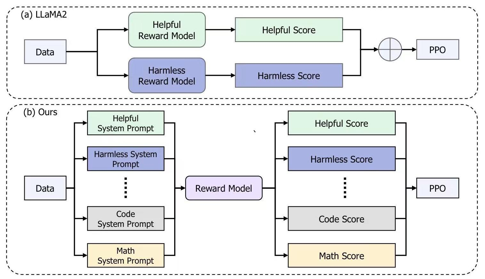
#### 预训练 Pre-train
##### 文本数据  
存储格式：`jsonl`  

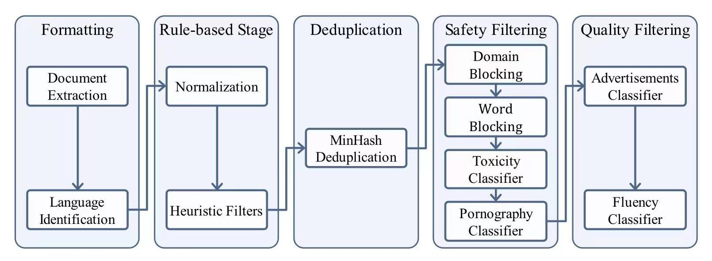  

##### 代码数据      
存储格式：`markdown`    

##### 长文本数据    
数据过滤管道：长度选择、统计过滤器、语言模型perplexity  
#### Alignment
* ***有监督微调***
* ***COOL RLFH***
  * 整合多个偏好建立奖励机制
  * 将不同的prompt应用于不同类型的偏好
#### 评估与总结
`InternLM2`大语言模型在主观和客观的评估中都表现出出色的性能。  

## 第二课 笔记&作业
`项目实战课`
* 部署`InternLM2-Chat-1.8B`模型进行智能对话
  
结果： 
  
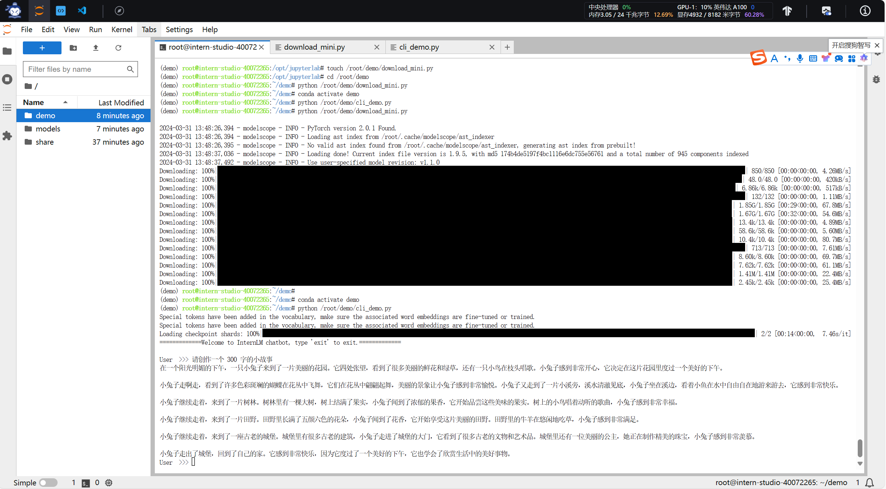
* 部署实战营优秀作品`八戒-Chat-1.8B`模型

  
结果：

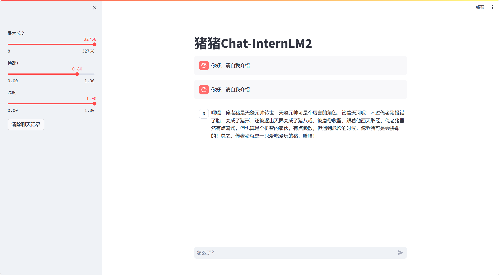
* 通过`InternLM2-Chat-7B`运行 ***Lagent*** 智能体 Demo

结果：  

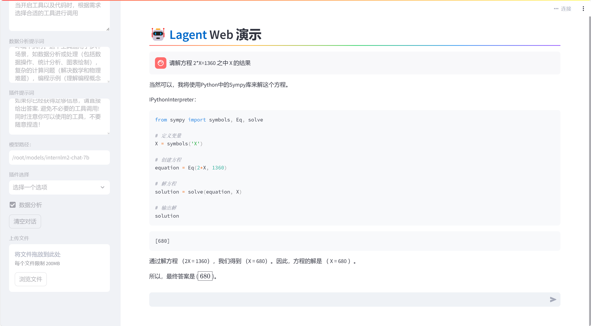
* 实践部署`浦语·灵笔2`模型

结果：  

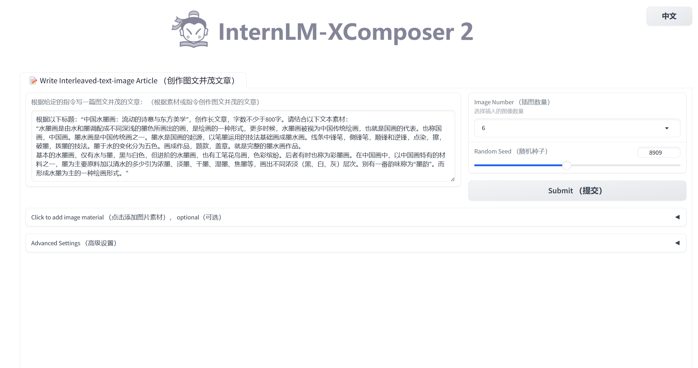  
  
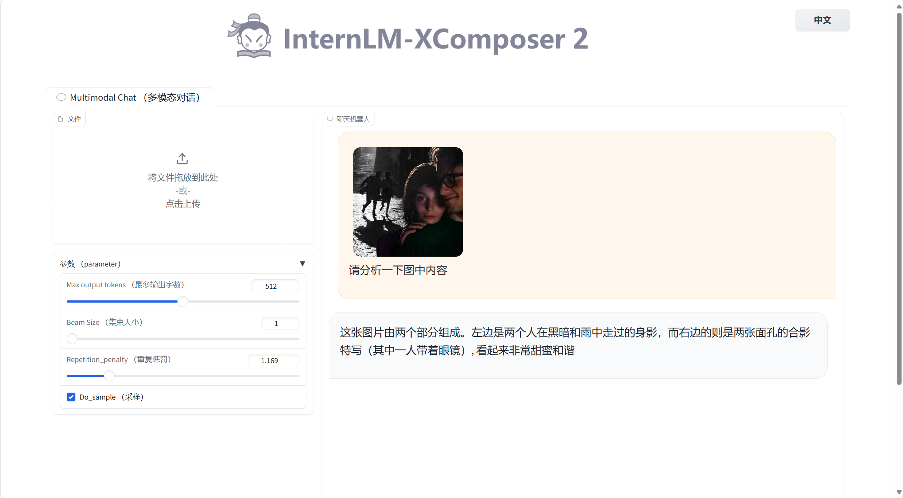

## 第三课—— *RAG智能助手：以茴香豆为例*
### RAG介绍  

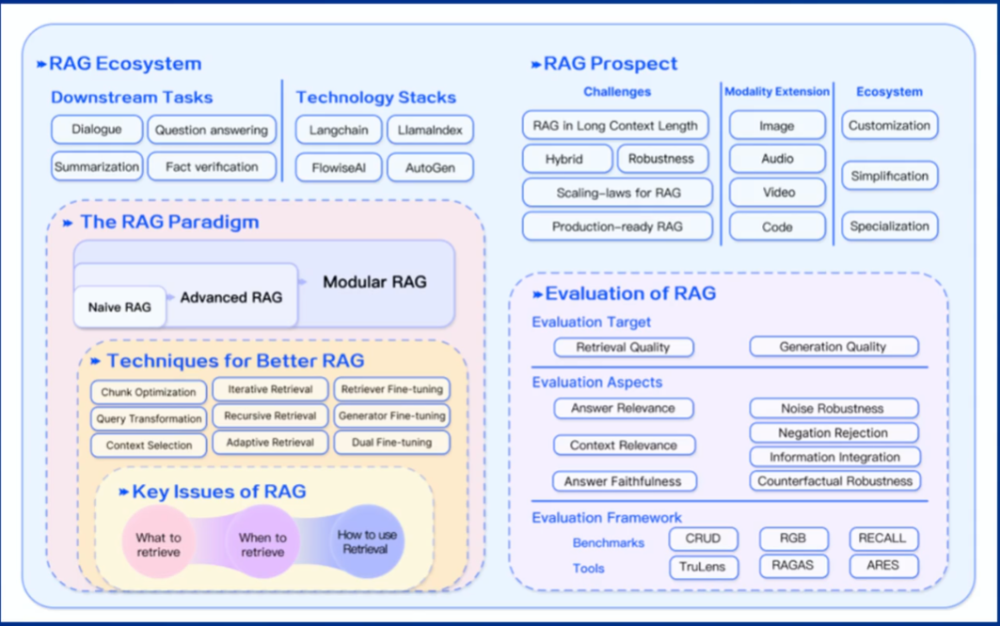   

#### 技术概览
* 定义: ***RAG***是一种结合了检索和生成的技术，旨在通过利用**外部知识库**来增强大语言模型的性能。它通过检索与用户输入相关的信息片段生成更准确的答案
* 应用
  * 问答系统
  * 文本生成
  * 信息检索
  * 图片描述

  
***向量数据库（vector-DB）***：
* 数据存储：将文本等数据通过预训练模型转为固定长度的向量表示
* 相似性检索：根据用户的查询向量，使用向量数据库找出最相关向量的过程。通常通过计算*余弦相似度*或其他相似性度量来完成
* 向量表示的优化：使用更高级的文本编码技术，如句子嵌入或段落嵌入
#### 工作原理&流程 

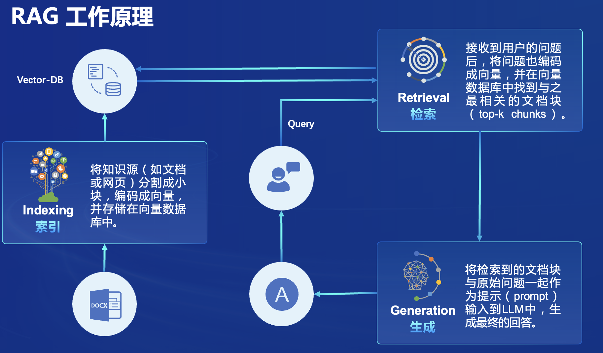  
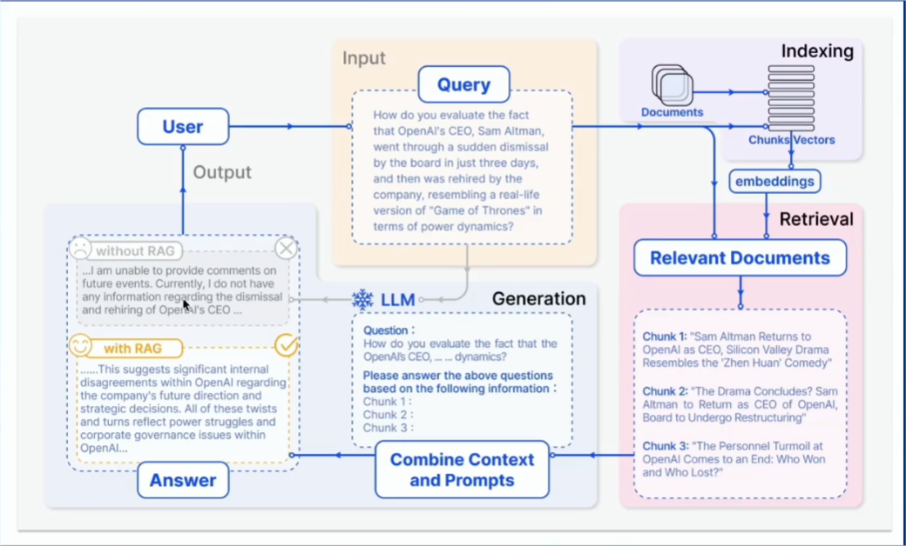  
 
#### 发展进程
* `Naive RAG`
  * 问答系统
  * 信息检索
* `Advanced RAG`
  * 摘要生成
  * 内容推荐
* `Modular RAG`
  * 多模态任务
  * 对话系统

#### 常见优化方法
* 嵌入优化（Embedding Optimization）
  * 结合稀疏和密集检索
  * 多任务
* 索引优化（Indexing Optimization）
  * 细粒度分割（Chunk）
  * 元数据
* 查询优化（Query Optimization）
  * 查询扩展、转换
  * 多查询
* 上下文管理（Context Optimization）
  * 重排（remark）
  * 上下文选择/压缩
* 迭代检索（Iterative Optimization）
  * 根据初始查询和迄今为止生成的文本进行重复搜索
* 递归检索（Recursive Optimization）
  * 迭代细化搜索查询
  * 链式推理（Chain-of-Thought）指导检索过程
* 自适应检索（Adaptive Optimization）
  * Flare，Self-RAG
  * 使用LLMs主动决定检索的最佳时机
#### RAG VS 微调（Fine-tuning） 
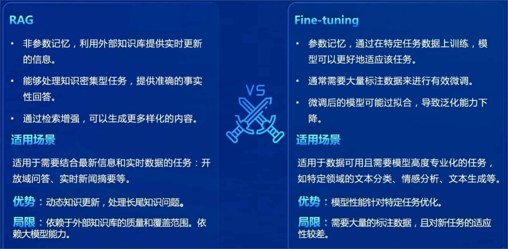  

#### 评估框架和基准测试
* 经典评估指标：`准确率` `召回率` `F1分数` `BLEU分数` `ROUGE分数`
* RAG评测框架
   * 基准测试 - RGB RECALL CRUD
   * 评测工具 - RAGAS ARES Trulens
### [`茴香豆`](https://github.com/InternLM/HuixiangDou)
#### 介绍
茴香豆是一个基于LLMs的领域知识助手，由书生浦语团队开发的开元大模型应用
* 专为即时通讯工具中的群聊场景优化的工作流，提供及时准确的技术支持和自动化问答服务
* 通过应用RAG技术，茴香豆能够理解和高效准确的回应与特定知识领域相关的复杂查询
#### 核心特征
* 开源免费
* 高效准确 Hybrid LLMs 专为群聊优化
* 领域知识
* 部署成本低
* 安全 可完全本地部署
* 扩展性强 兼容多种IM软件，支持多种开源LLMs和云端api
#### 工作流
* 多来源检索
  * 向量数据库
  * 网络搜索结果
  * 知识图谱
* 混合大模型
   * 本地LLM
   * 远程LLM
* 多重评分 拒答工作流
  * 回答有效
  * 避免信息泛滥
* 安全检查
  * 多种手段
  * 确保回答合规

