## 第三课作业
* 在 InternLM Studio 上部署`茴香豆技术助手`

  
**结果：**  
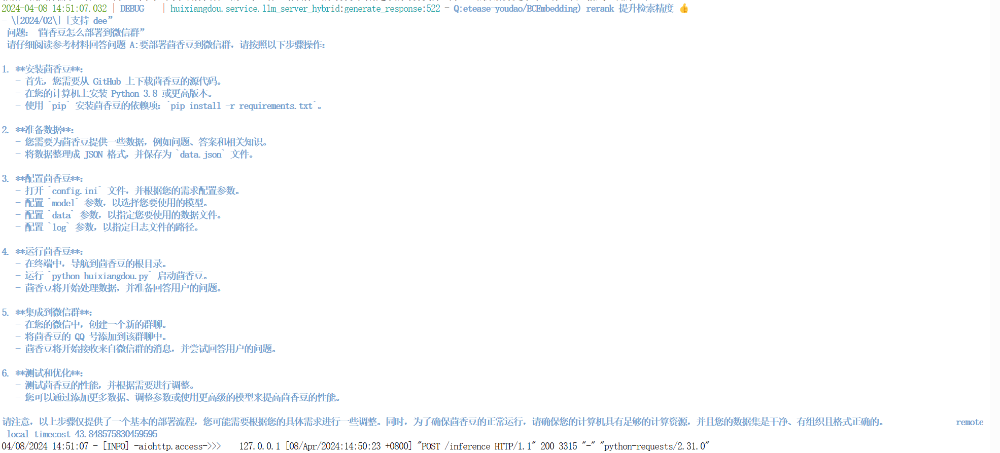  

* 在[茴香豆 Web](https://openxlab.org.cn/apps/detail/tpoisonooo/huixiangdou-web) 版中创建自己领域的`知识问答助手`
  * 参考[教程](https://www.bilibili.com/video/BV1S2421N7mn/)
  * 上传本地文档***AI算法总结***
  * 设定拒答与应答流相应模版

**五轮对话：**
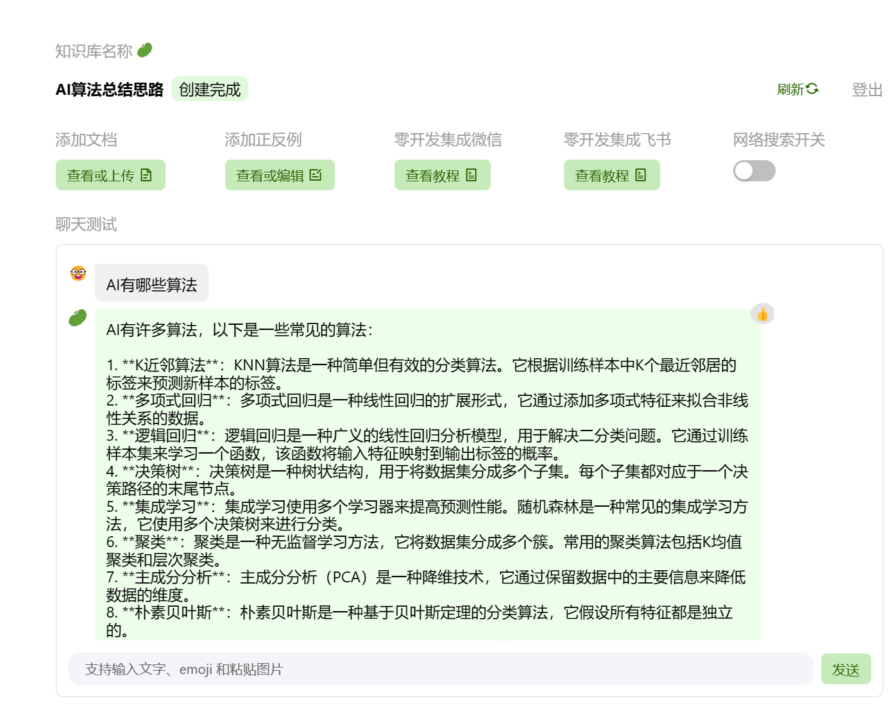   
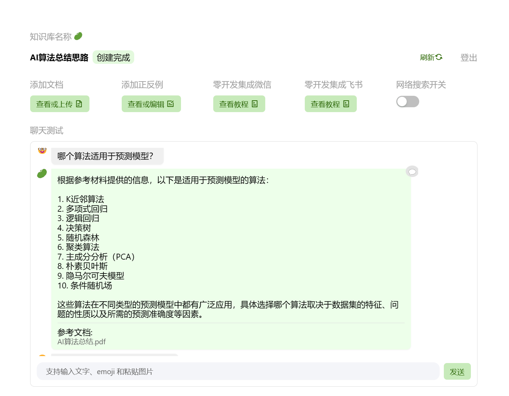  
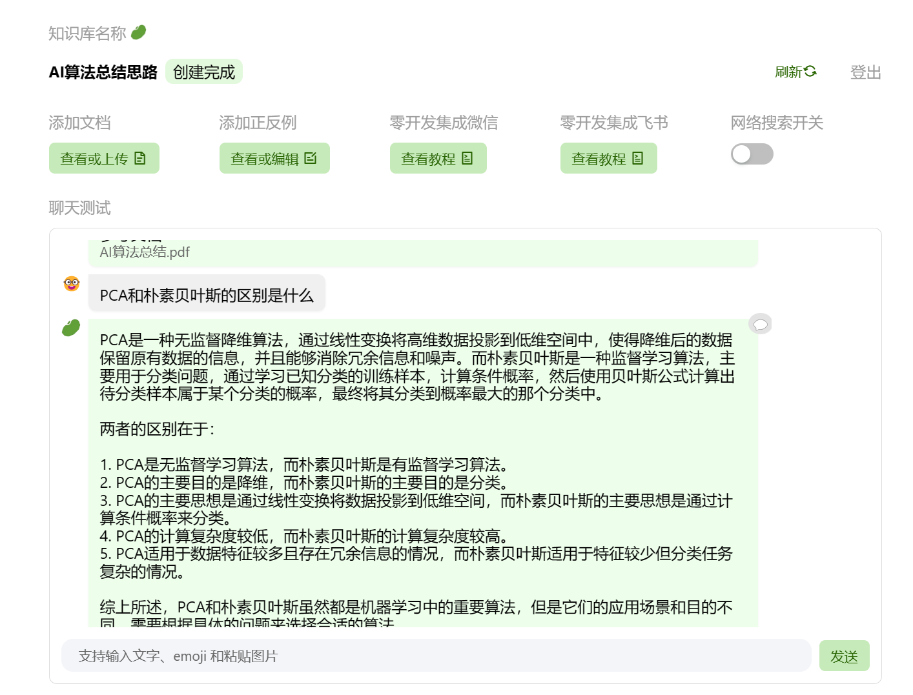  
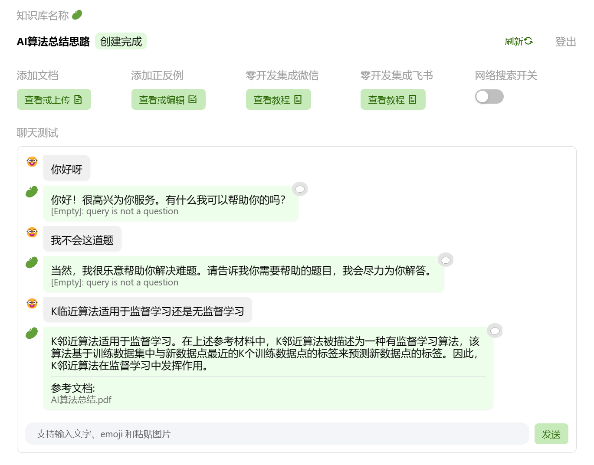  

## 第四课作业
### 训练小助手认知  
#### 流程准备  
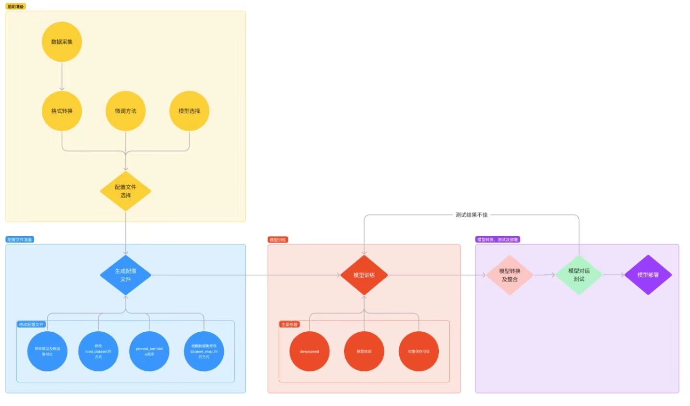 
#### 复现结果
* **300轮训练结果**

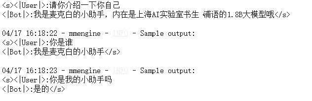   
* **600轮训练结果**（过拟合）

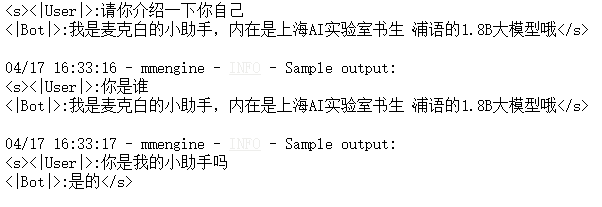   
* **训练完所持文件**

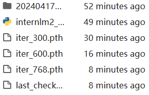   

## 第五课作业
#### 部署成果
 
#### 优化前（使用transform架构）
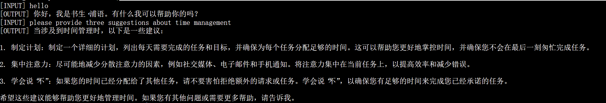 
#### 优化后
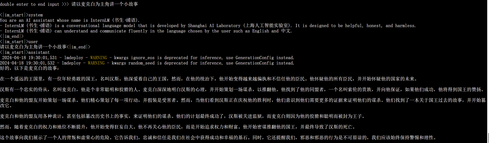 

## 第六课作业
### Lagent web demo
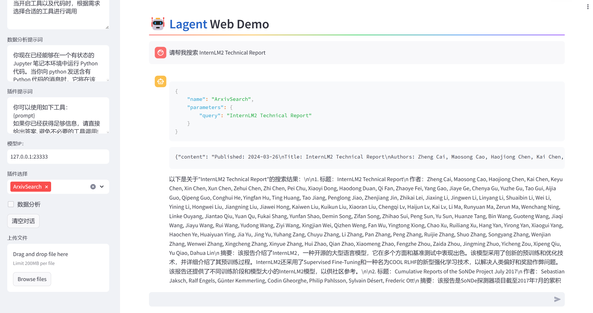 
### `Lagent`自定义工具调用
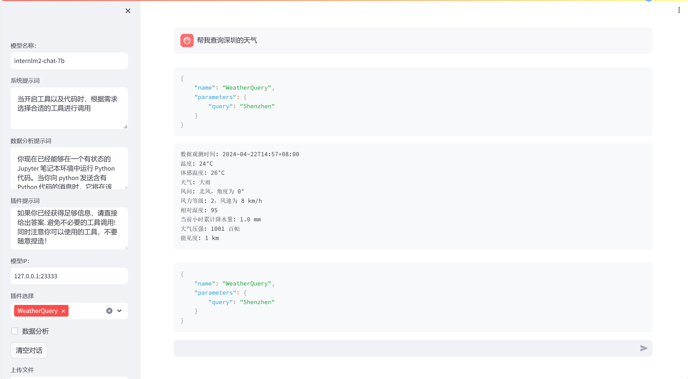 
### `AgentLego`直接使用部分
 
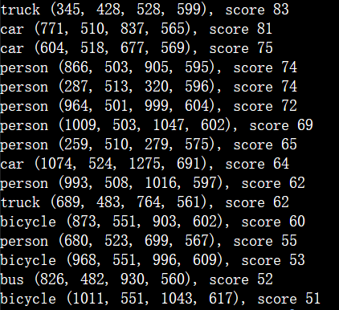 
### AgentLego WebUI
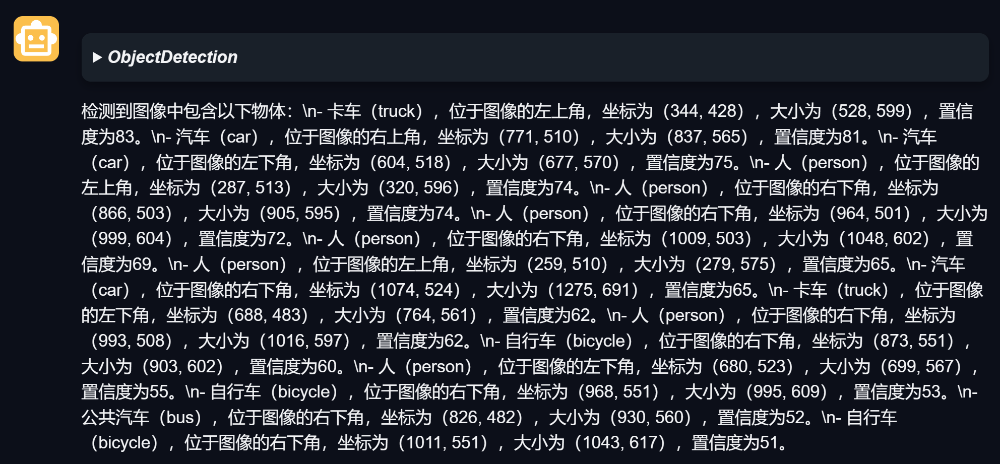 
